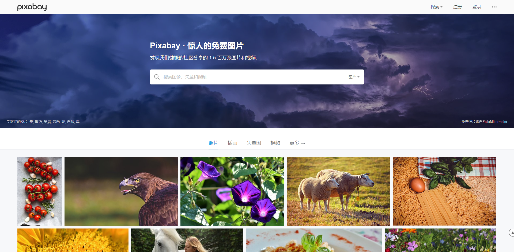
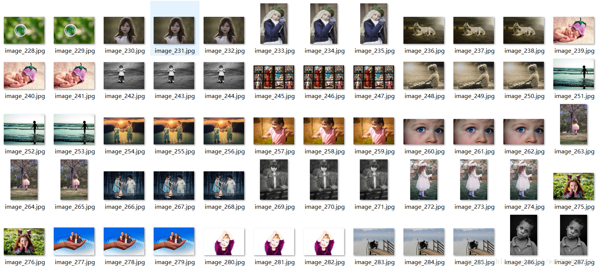

README -- LifeCat Python
===========================
 
:cat: :smiley_cat: :kissing_cat:

|title|content|
|:---:|:---:
|desc|智能成长相册系统LifeCat-Python
|author|ten
|version|Version 2
|date|2018
|framework|python
******************************************************************************

#### 1.Python爬虫项目 
#### 2.无线传感器网络模拟项目 
#### 3.图像处理项目
#### 4.机器学习项目

******************************************************************************
### _[Python爬虫项目](#)_

#### 爬虫项目目录:
##### image_crawler: 图像爬虫，从网络下载图像到本地
##### distributed_crawler: 分布式爬

---------------------------------------------------------------
#### image_crawler
**功能：**
  使用`python`爬取并下载图片到本地  
  
**目的：**
  获取lifecat相册处理系统的demo数据，故采用python爬虫从pixabay上爬取关键词=child的数据

**pixabay是优秀的图片搜索网站：https://pixabay.com/**

**下载情况：**

---------------------------------------------------------------
### _[无线传感器网络模拟项目](#)_

#### wireless_network
  * 无线传感网络模拟
    * 连通率分析
    * 覆盖率分析

-----------------------------------------------------------------
### _[图像处理项目](#)_

#### 图像处理项目:
##### image_processing
  * fastcv2
    * 快速调用opencv库
  * image_segmentation
    * 静态图像分割
    * 图像聚类算法
    * 图像分类算法
  * video_segmentation
    * 视频目标分割
 
##### 

---------------------------------------------------------------
### _[机器学习项目](#)_

#### 机器学习项目目录
##### data_processing
  * iris 贝叶斯算法实现iris数据集分类
  * wine 贝叶斯算法实现wine数据集分类
##### ai
  * gobang: 通过博弈树实现五子棋AI

*****************************************************************************
### _@总体项目分析_
  
  [项目流程分析介绍](https://zhuanlan.zhihu.com/p/41211110) (点击链接)  
  
  进行了项目结构、项目目录、项目流程的分析

******************************************************************************
### 相关项目：
#### [LifeCat version1 servlet基础Javaweb服务网站](https://github.com/kevinten10/lifecatweb)
#### [LifeCat version2 version1相应SSM后台管理系统](https://github.com/kevinten10/SSM-lifecat)
#### [LifeCat version3 前后端分离springboot后端](https://github.com/kevinten10/springboot-lifecat)
#### [LifeCat version3 前后端分离vuejs前端](https://github.com/kevinten10/Web-lifecat)
*****************************************************************************
#### [LifeCat hadoop 分布式平台进行数据处理](https://github.com/kevinten10/Hadoop-lifecat)
#### [LifeCat android 相应Android相册应用](https://github.com/kevinten10/Android-lifecat)
#### [LifeCat wechat 微信端小程序](https://github.com/kevinten10/WeChat-lifecat)

